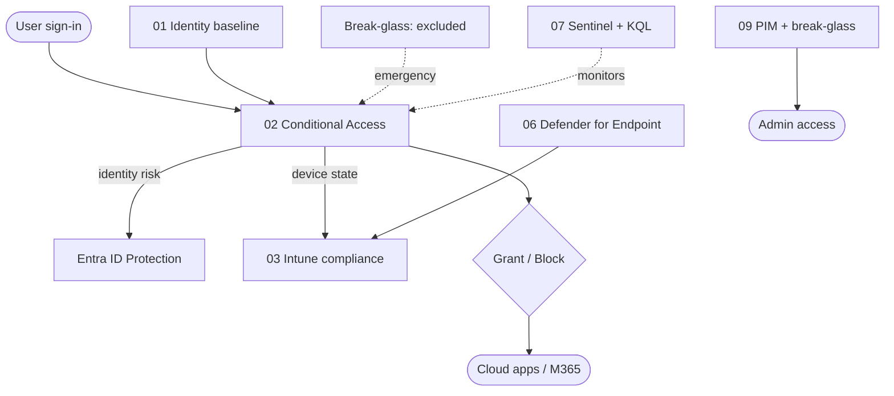

# Azure Entra Zero Trust Landing Zone

A portfolio-grade, **Terraform-driven** reference implementation of Zero Trust across Microsoft Entra ID, Intune, and Defender. It demonstrates the ability to **design, codify, and document** enterprise identity and device security controls — not just configure them by hand.

> **Status: building in public, in phases.** The full architecture is designed up front (below); modules are implemented and published incrementally. Each shipped module includes the Terraform, an Architectural Decision Record (ADR), and a "why this matters" rationale. Phase 1 (identity baseline + Conditional Access) is deployed and evidenced; CA004 is republished in report-only pending observation.

## Why this exists
Most identity work is invisible — a policy clicked in a portal leaves no artifact. This repo makes the *design thinking* visible: every control is codified, every trade-off is written down, and the architecture maps to Zero Trust principles. It's the bridge between administering Entra and architecting identity security.

## Architecture at a glance



### Module status
| # | Module | Purpose | Zero Trust pillar | Status |
|---|--------|---------|-------------------|--------|
| 01 | identity-baseline | Tenant hardening, dynamic groups, break-glass | Identity | ✅ Done |
| 02 | conditional-access | CA policy framework as reusable Terraform | Identity | ✅ Done (CA004 report-only) |
| 03 | device-compliance | Intune compliance + Defender risk-score gating | Devices | 🗓 Planned (Phase 2) |
| 04 | autopilot | Windows Autopilot provisioning | Devices | 🗓 Planned (Phase 2) |
| 05 | update-rings | Patch rings (pilot / broad) | Devices | 🗓 Planned (Phase 2) |
| 06 | defender-endpoint | Defender for Endpoint baseline + ASR | Threat protection | 🗓 Planned (Phase 2) |
| 07 | sentinel-kql | Sentinel + KQL detections | Detection | 🗓 Planned (Phase 3) |
| 08 | cloud-lifecycle-automation | Cloud-only JML demo (links to LOA repo) | Automation | 🗓 Planned (Phase 3) |
| 09 | administrative-governance | Break-glass + PIM | Identity / Governance | 🚧 In progress (break-glass done; PIM Phase 3) |

### Conditional Access policy set (module 02, implemented)
- Block legacy authentication
- Require MFA for all users (break-glass excluded)
- Block high-risk sign-ins (Entra ID Protection / P2)
- Remediate high user risk with MFA + secure password change (report-only)

All policies are produced from a single reusable Terraform module and exclude a dedicated break-glass group.

## Repository structure
```
.
├── terraform/                  # the run-root — all live config; run terraform here
│   ├── providers.tf  versions.tf  variables.tf  backend.tf
│   ├── break-glass.tf  identity-baseline.tf  conditional-access.tf
│   └── modules/conditional-access-policy/    # reusable CA policy module
├── 01-identity-baseline/ … 09-administrative-governance/   # per-area design docs
├── docs/                       # architecture, threat model, ADRs, screenshots
└── README.md
```
> Runnable Terraform lives only in `terraform/`. The numbered folders are the design/documentation map for each area.

## Deploy it yourself
**Prerequisites:** Terraform ≥ 1.6, Azure CLI, a demo Entra tenant, and Entra ID P2 (for risk-based CA and PIM). Later modules need additional Intune/Defender licensing — see [assumptions](docs/assumptions-limitations.md).

```bash
az login --tenant <your-tenant-id>
cd terraform
terraform init
terraform plan
terraform apply
```
Conditional Access requires Security Defaults to be **disabled** first — see [ADR-002](docs/adr/adr-002-break-glass-exclusion.md) for the safe sequence and the break-glass design that makes it safe.

## Design docs
- [Architecture](docs/architecture.md)
- [Threat model](docs/threat-model.md)
- [Assumptions & limitations](docs/assumptions-limitations.md)
- [Architectural Decision Records](docs/adr/)
- [Evidence / screenshots](docs/screenshots.md)

## Security & sanitisation
This repo contains **no secrets, tenant identifiers, or state**. Terraform state and `*.tfvars` are gitignored. Screenshots are sanitised (tenant/subscription IDs cropped or blurred). Built and tested in a disposable developer tenant.

## License
MIT — see [LICENSE](LICENSE).
