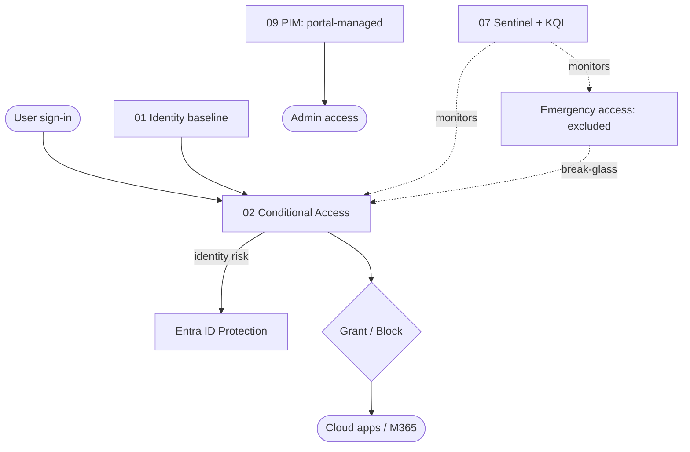

# Azure Entra Zero Trust Landing Zone

[](https://developer.hashicorp.com/terraform)  [](LICENSE)  

A **Terraform-driven** Zero Trust identity baseline for Microsoft Entra ID, built and evidenced in a live lab tenant. Conditional Access policies, emergency-account and exclusion-group configuration, and Sentinel detections are defined as code. Passkeys and PIM are portal-managed.

The standard this repository holds itself to: controls are defined as code, design decisions are recorded as Architectural Decision Records, and claims are paired with the artefact that licenses them. Where that standard is not yet met — a decision record still to be written, evidence not yet published — this README says so rather than implying otherwise.

> **Scope.** This repository covers **identity and detection**. The device-management area (Intune, Autopilot, update rings, Defender for Endpoint) was designed, evaluated, and then deliberately placed **out of scope** — see [Scope boundary](#scope-boundary) for the reasoning. Privileged Identity Management was configured and exercised in the portal; it is **not code-defined**, and its evidence is not yet published. Nothing here claims to be a complete Zero Trust implementation.

## What v1.0 is

v1.0 is the **terminal** release of this repository, not a milestone toward a larger roadmap. Its scope is an identity and detection baseline: tenant hardening, four Conditional Access policies rendered from one reusable module, emergency access with a role-assignable exclusion group, Privileged Identity Management exercised in the portal, and three Sentinel analytics rules defined as code. Device management is out of scope by decision, not by deferral.

Reaching v1.0 additionally requires a documentation truth pass across every public document, three remaining decision records (the Intune provider boundary, PIM alongside standing emergency access, and Sentinel detection-as-code), a sanitised evidence index pairing each claim with its artefact, and CI running `fmt -check`, `validate` and `tflint`. Those remain outstanding; where a claim is ahead of its evidence, this README says so.

## Why this exists

Most identity work is invisible — a policy clicked in a portal leaves no artifact. This repo makes the *design thinking* visible: controls are codified, trade-offs are written down, scope decisions are justified rather than quietly dropped, and every status word is chosen to mean exactly one thing. It's the bridge between administering Entra and architecting identity security.

## Architecture at a glance


```mermaid
flowchart TD
  user([User sign-in]) --> CA[02 Conditional Access]
  IB[01 Identity baseline] --> CA
  CA -->|identity risk| IDP[Entra ID Protection]
  BG[Emergency access: excluded] -. break-glass .-> CA
  CA --> grant{Grant / Block}
  grant --> apps([Cloud apps / M365])
  PIM[09 PIM: portal-managed] --> admin([Admin access])
  SEN[07 Sentinel + KQL] -. monitors .-> CA
  SEN -. monitors .-> BG
```

Device-management controls are not shown; they are out of scope for this release.

### Control status

Statuses below are used with fixed meanings: **Planned** (design only), **Code-defined** (configuration exists, no verified deployment), **Deployed** (object exists in the lab), **Report-only evaluated** (evaluated without enforcement), **Enabled and tested** (enforced, with a safe test and evidence record), **Portal-managed and evidenced** (implemented manually, with configuration and operational proof). "Complete" is deliberately not a status.

| # | Module | Purpose | Zero Trust pillar | Status |
|---|--------|---------|-------------------|--------|
| 01 | identity-baseline | Tenant hardening, dynamic groups, emergency access | Identity | Enabled and tested |
| 02 | conditional-access | CA policy framework as reusable Terraform | Identity | Enabled and tested (CA004: Report-only evaluated) |
| 07 | sentinel-kql | Sentinel workspace, Entra log export, KQL detections as code | Detection | Deployed; see [detection detail](#sentinel-detections-module-07) |
| 09 | administrative-governance | Emergency access | Identity / Governance | Enabled and tested |
| 08 | cloud-lifecycle-automation | Cloud-only joiner/mover/leaver automation | Automation | Planned — not implemented; see [Linked work](#linked-work) |

### Scope boundary

Modules 03–06 are **out of scope for v1.0**. This is a decision, not a backlog item.

| # | Module | Reason |
|---|--------|--------|
| 03 | device-compliance | Intune configuration lives in Microsoft Graph, while AzAPI targets Azure Resource Manager — the originally planned provider approach was structurally impossible |
| 04 | autopilot | Same provider boundary |
| 05 | update-rings | Same provider boundary |
| 06 | defender-endpoint | Same provider boundary; also depends on 03 |

Three Terraform providers were evaluated as alternatives (`microsoft/msgraph` public preview, `deploymenttheory/microsoft365`, `terraprovider/microsoft365wp`). None was adopted for this release. The directories are retained with their design notes: a documented scope boundary is evidence of a decision, whereas a deleted directory is evidence of nothing. The decision record for this — including the specific conditions that would cause it to be revisited — is in preparation.

### Conditional Access policy set (module 02)

| ID | Policy | State |
|---|---|---|
| CA001 | Block legacy authentication | Enabled and tested |
| CA002 | Require MFA for all users, emergency accounts excluded | Enabled and tested |
| CA003 | Block high-risk sign-ins (Entra ID Protection / P2) | Enabled and tested |
| CA004 | Remediate high user risk with MFA + secure password change | Report-only evaluated |

All four policies are rendered from a single reusable Terraform module and exclude the dedicated emergency-access groups. Both the legacy group and the role-assignable group are currently in the active exclusion path for every one of the four policies.

**CA004 is deployed in report-only mode** and evaluated with Conditional Access What If for a high-user-risk scenario: it *would* require MFA and a secure password change. No genuine high-risk sign-in occurred in this lab tenant, so no report-only enforcement telemetry exists, and none was manufactured. Report-only means evaluated, not enforced — it neither blocks nor remediates. Promotion to enforced is **not** planned for this release.

### Sentinel detections (module 07)

A Log Analytics workspace with Microsoft Sentinel, a tenant-scoped Entra diagnostic setting exporting sign-in and audit logs, and three scheduled analytics rules — all defined in Terraform, in a separate root with its own state.

| Detection | Status |
|---|---|
| Emergency account sign-in | Enabled and tested — fired on a real emergency-account sign-in |
| Protected exclusion group membership changed | Enabled and tested — fired on a real membership change to the live exclusion group |
| Password-spray indicator | Deployed and query-validated; no positive event generated, and none simulated |

These are **lab baselines, not production detections**: no entity mapping, no allowlists, no assigned owner, no response procedure. Rule frequency and lookback windows deliberately overlap, which produces occasional duplicate alerts — a documented, accepted trade-off rather than a tuning defect. Ingestion lag was measured rather than assumed (sign-in logs averaged ~1.5 minutes, audit logs ~3.4 minutes with an observed maximum of 7, following a ~15-hour delay on first enablement).

### Emergency access

Two standing Global Administrator accounts, excluded from all four Conditional Access policies, with passkey authentication and Sentinel alerting on their sign-ins.

A **role-assignable parallel exclusion group** is code-defined and applied, with dual exclusions and Sentinel membership monitoring. Public validation evidence is pending. The `isAssignableToRole` property cannot be added to an existing group, so migration was staged additively across four reviewed plans rather than replacing the original group — a replacement would have changed the object ID that every Conditional Access policy references. The legacy exclusion remains active; its retirement is deliberately deferred pending an observation period.

The exclusions apply to **this repository's** Conditional Access policies. They do not bypass Microsoft's mandatory portal MFA, and the emergency accounts still authenticate with their passkeys.

## Linked work

The adjacent [manage-user-loa](https://github.com/Dhanzz1/manage-user-loa) repository is a PowerShell module for **hybrid Active Directory and Exchange leave-of-absence automation**, exposing `Start-UserLOA` and `End-UserLOA`. It disables and restores the account, moves the user in and out of a leave OU, hides and restores GAL visibility, delegates manager mailbox access, and applies out-of-office behaviour.

That is related identity-lifecycle work, but it is **not** an implementation of module 08. The cloud-only joiner/mover/leaver workflow that module 08 sketches is not implemented in either repository. Adjacent work and delivered scope are different claims, and blending them would misrepresent both.

## Repository structure

```
.
├── terraform/                  # identity run-root — Entra ID and Conditional Access
│   ├── providers.tf  versions.tf  variables.tf  backend.tf
│   ├── break-glass.tf  identity-baseline.tf  conditional-access.tf
│   ├── modules/conditional-access-policy/    # reusable CA policy module
│   └── detections/             # separate run-root — Sentinel workspace and analytics rules
├── 01-identity-baseline/ … 09-administrative-governance/   # per-area design docs
├── docs/                       # architecture, threat model, ADRs, screenshots
└── README.md
```

> Runnable Terraform lives only in `terraform/` and `terraform/detections/`. These are **two separate roots with separate state** — the identity root uses the `azuread` provider, the detections root uses `azurerm`. The numbered folders are the design map for each area.

## Deploy it yourself

**Prerequisites:** Terraform ≥ 1.7, Azure CLI, a disposable Entra tenant, and Entra ID P2 (for risk-based Conditional Access and PIM). The detections root additionally requires an Azure subscription for the Log Analytics workspace and Sentinel.

```bash
az login --tenant <your-tenant-id>

# identity root
cd terraform
terraform init && terraform plan -out tfplan && terraform apply tfplan

# detections root (separate state)
cd detections
terraform init && terraform plan -out tfplan && terraform apply tfplan
```

Conditional Access requires Security Defaults to be **disabled** first — see [ADR-002](docs/adr/adr-002-break-glass-exclusion.md) for the safe sequence and the emergency-access design that makes it safe.

Apply from a saved plan file. Several of these applies modify live Conditional Access exclusions, where "the plan I reviewed is the plan that ran" stops being a formality.

## Known limitations

- **Terraform state is local**, one state file per root, with no remote backend or locking. A lab limitation, not a recommended pattern.
- **PIM is portal-managed.** Directory-role activation settings and the eligible assignment were configured and exercised during the licensed lab window: activation, justification, expiry and post-expiry behaviour were all observed. Public evidence is pending. They are not code-defined. PIM eligible assignments are also removed when the P2 licence lapses, so that evidence represents the licensed window rather than a persistent state.
- **Provider versions:** `hashicorp/azuread ~> 2.50` (v2.53.1 in use). The v3 line has not been adopted.
- **CA005 and CA006 are not implemented** — not planned for this release.
- Fuller detail, including the reference tenant profile every trade-off is sized against, is in [assumptions & limitations](docs/assumptions-limitations.md).

## Design docs

- [Architecture](docs/architecture.md)
- [Threat model](docs/threat-model.md)
- [Assumptions & limitations](docs/assumptions-limitations.md)
- [Architectural Decision Records](docs/adr/)
- [Evidence / screenshots](docs/screenshots.md)

## Security & sanitisation

This repository contains **no secrets, tenant identifiers, or state**. Terraform state, `*.tfvars`, plan files and provider schema are gitignored. Screenshots are sanitised — tenant and subscription identifiers, source IP addresses and credential-provider detail are cropped or redacted. Everything was built in a disposable developer tenant.

## License

MIT — see [LICENSE](LICENSE).
